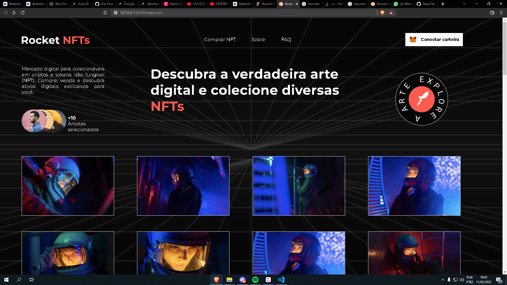

  <a href="#-tecnologias">Tecnologias</a>&nbsp;&nbsp;&nbsp;|&nbsp;&nbsp;&nbsp;
  <a href="#-projeto">Projeto</a>&nbsp;&nbsp;&nbsp;|&nbsp;&nbsp;&nbsp;
  <a href="#-notion">Notion</a>

 

  

## 🚀 Tecnologias

Esse projeto foi desenvolvido com as seguintes tecnologias:

- HTML
- CSS

Bibliotecas

- [Google Fonts](https://fonts.google.com/)

## 💻 Projeto

O Rocket NFTS é uma pagina de vendas de NFTS sobre fotos de astronautas. O Projeto é um desafio do Rocket Seat Discover, fiz para testar minhas capacidades já q fazia tempo q nao programava

## 📝 Notion

Você pode visualizar as intruções do desafio atráves [desse link](https://efficient-sloth-d85.notion.site/Desafio-Rocket-NFTs-3b5703b9f0e74cb19f34a8bfd14faacb). Não é necessário ter conta no Notion

Feito com ♥ by Renan and Rocketseat
